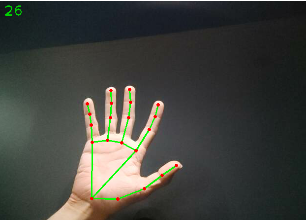

# Image-Recognition-Modules
Image Recognition python modules developed for ease of development of new apps/projects. Based on the freeCodeCamp Computer Vision Course.

# 1.Hand Tracking Module

Includes module and sample main file to run a simple hand tracking app with an available webcam. Number of hands to track can be modified.

# 2.Pose Estimation Module

Includes module and sample main file to run a simple body pose estimator app on a video file or, alternatively, a webcam.

# 3.Face Detection Module

Includes module and sample main file to run a simple face detector app on a video file or, alternatively, a webcam. Works with multiple faces on a single input.

# 4. Face Mesh Module

Includes module and sample main file to structure a face mesh on detected faces on a video file or, alternatively, a webcam. Works with multiple faces on a single input.

